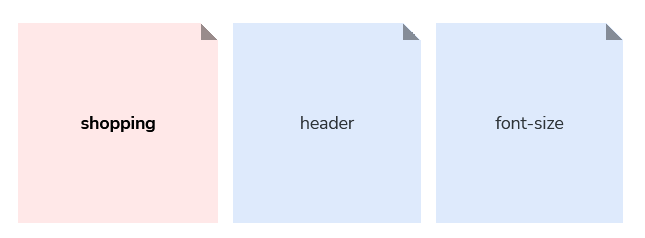
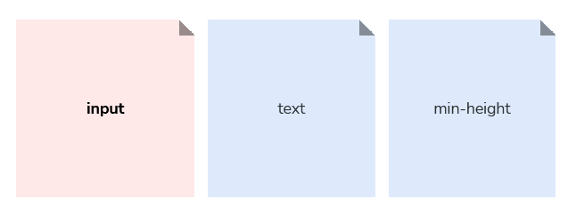
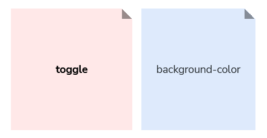
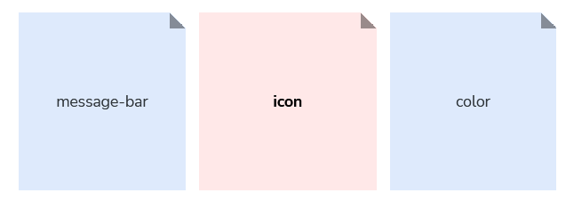
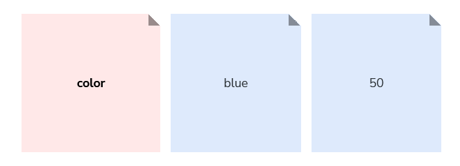
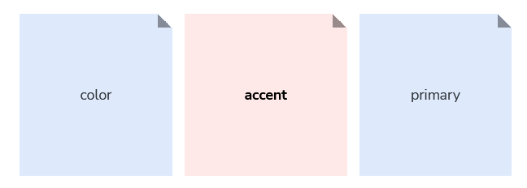
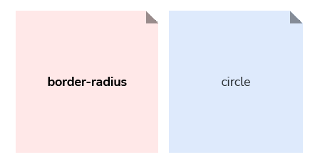
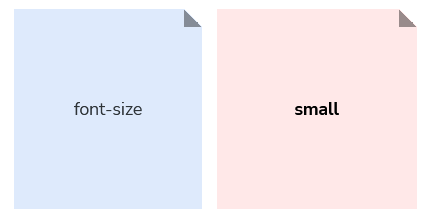
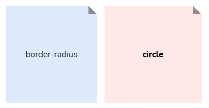

# Design tokens

## What are design tokens?

Design tokens capture raw values that represent user interface design styling decisions, such as color or font size, with variables under a consistent naming structure that conveys purpose and intent.

Design tokens are language-agnostic, and can be translated to any environment. On Firefox for desktop, variables are represented in CSS.

For example, [moz-toggle](https://searchfox.org/mozilla-central/source/toolkit/content/widgets/moz-toggle) uses several design tokens. Here are a few:

<table>
  <tr>
    <th>Component token</th>
    <th>Alias of token</th>
    <th>Value</th>
  </tr>
  <tr>
    <td><code>--toggle-width</code></td>
    <td><code>--size-item-large</code></td>
    <td><code>32px</code></td>
  </tr>
  <tr>
    <td><code>--toggle-background-color-pressed</code></td>
    <td><code>--color-accent-primary</code></td>
    <td><code>--color-blue-60</code>(<code>oklch(55% 0.24 260)</code>)</td>
  </tr>
  <tr>
    <td><code>--toggle-border-radius</code></td>
    <td><code>--border-radius-circle</code></td>
    <td><code>9999px</code></td>
  </tr>
</table>

Although the design tokens methodology is industry-wide, there is no one-size-fits-all approach. Therefore, our design tokens are defined and implemented for the purposes of serving Firefox UI. This document should capture everything you need to know about [our design system's](https://acorn.firefox.com/) design tokens.

The goal is for all of us who work on Firefox to share a common and maintainable system for how we refer to and consume UI styles, and for Firefox UI to be styled consistently.

## Taxonomy

_The following documentation borrows from Nathan Curtis' essay on [Naming Design Tokens](https://medium.com/eightshapes-llc/naming-tokens-in-design-systems-9e86c7444676)._

Design tokens' variable names follow a taxonomy with distinct classification levels and sublevels, forming a prescriptive vocabulary of descriptive terms which are classified by category.

![
  Our design system taxonomy has distinct classifiction levels and sublevels. \
  There are four high level buckets: Ecosystem, Object, Category, and Modifier. \
  Within the Ecosystem bucket is one sublevel: Domain. \
  Within the Object bucket are three sublevels: Pattern, Component, and Element. \
  Within the Category bucket are three sublevels: Type, Concept, and Property. \
  Within the Modifier bucket are three sublevels: Variant, State, and Scale. \
  Each of these levels and sublevels are explained in further detail after this graphic. \
  ](./img/taxonomy-overview.png)

### Ecosystem
The ecosystem level helps describe the context that a token is scoped to.

#### Domain
A token is only prefixed with a domain when there is a need to specify its context.

For example, if a token is specific to a certain feature, you can use the domain level to specify the name of the feature that it belongs to. Don't forget to keep domain-specific tokens within the feature's CSS so that they can only be reused within its domain.



### Objects
The object level helps define the object (or objects) that the token applies to.

#### Pattern
A design pattern that is composed of, or represents, multiple related components.



#### Component
The component name.



#### Nested element
Any element that may be nested within a component (e.g. an icon).



### Categories
The category level helps define the visual style that apply to the token.

#### Type
The type of style category a design token belongs to.



#### Concept
A concept further describes user interface styles. They are either industry-wide patterns, or they are terms determined by our team based on specific user interface style needs. For example, "accent" is a common design industry term used for deliniating a brand's or product's accent color(s) that we happen to use for our color tokens.



To further illustrate this taxonomy level, here are detailed explanations and definitions of existing concepts:

##### Accent
We use the "accent" color concept for referring to our brand and the operating system (platform) accent colors. The brand and platform accent colors are used as the primary color for accentuating and characterizing several Firefox UI elements' (e.g. buttons, focus outlines, links, icons, and more).

##### Interactive
We use the "interactive" concept to describe design tokens that pertain to interactive elements. For example, `--border-color-interactive` is used on [moz-toggle](https://searchfox.org/mozilla-central/rev/956e25260926097a4d54d5aeb0e06347841616bf/toolkit/content/widgets/moz-toggle/moz-toggle.css#40) since interactive elements such as toggles, radios, and checkboxes share the same border color pattern that is different from our default border color.

```css
/* moz-toggle.css */
--toggle-border-color: var(--border-color-interactive);
```

##### Item
We use the "item" concept as a modifier on top of the "size" type tokens group to refer to different interface items, or elements, that often rely on the same standard width and height dimensions. The word item should imply that this is a small sizing scale dedicated for dimensions that get applied to smaller UI pieces such as icons, logos, and avatars, as opposed to large compositions or areas such as the width set for onboarding illustrations, or the width of a sidebar or main column within a page's template.

```css
/* tokens-shared.css */
--size-item-small: 16px;
--size-item-large: 32px;
```

#### Property
A property (e.g. size, width, color, fill) further describes a design tokens' style, although this is not to be confused with the categorical type of token mentioned above, albeit they often use similar terms. Note that sometimes properties are double-worded, and that's totally fine (e.g. min-width, background-color)



### Modifiers
The modifier level helps further classify a design token's characteristic with further specification.

#### Variant
A variant specifies a token from a group of tokens related by a common meaning but that have varying purpose.


#### State
A state defines possible intereactive states of a design token.
(e.g. hover, active, focus, disabled)


#### Scale
A scale defines a collection of tokens that relate to one another's but vary by their type, such as a collection of size units, or any other relationship that requires differentiating tokens by a determined scale.



Today we have scales based off a sequence of numbers or t-shirt sizing.

We use a sequence numbers for collections that have attributes that change as the number goes up, such as colors getting darker.

Number-based scale grows by 10:
 * 10
 * 20
 * 30
 * 40
 * 50
 * 60
 * and so on...

For collections that do have sizing relationships, we use t-shirt sizing names:

 * xsmall
 * small
 * medium
 * large
 * xlarge
 * xxlarge
 * and so on...

These are some of our font sizes as an example:

```css
/* tokens-brand.css */
--font-size-root: 15px;
--font-size-small: 0.867rem;  /* 13px */
--font-size-large: 1.133rem;  /* 17px */
--font-size-xlarge: 1.467rem; /* 22px */
```

You will see that the font size scale is missing what would be a logical "medium" size in between "small" and "large", and that it has a `--font-size-root` within it too; that's because we use more specific words within scales that contain tokens that serve a specific purpose within that scale.

The `--font-size-root` token was created for specific use under the document's `:root` in order to set the default font size for our relative typography scale. We label our default font size token as `root` in order to be specific **and** intentional.


It's okay to include intentional terms within scales that better represent the meaning of a value and when to use it. For example, our border radius collection, which uses t-shirt sizing, also mixes the 'circle' option within its scale in order to describe a border radius that will create a circular effect:




## Naming guidelines
The goal of design tokens naming is modularity and legibility.


Meanings and the relationship between meanings can be complex, therefore taxonomy levels are chained to provide clarity. (see example above)

The example above also helps illustrate that not all levels are required when naming a token. A name just needs enough levels to imply the token's use and define its meaning. Different combinations of different levels helps us arrive at meaningful names.

Names shouldn't be redundant and should be kept simple. They should only include enough levels to describe and communicate the token's intent and purpose.

## How it works
The desktop tokens system serves our browser's two different ecosystems, the chrome and in-content (about:) pages, since they don't always share the same styling decisions, and consequently, values.

The chrome of the browser is styled to look and feel like it belongs to the user's operating system, and to also support theming. Therefore typography and color rules are different from the rest of our application features that load within in-content pages.

### Token files
Token files are stored in the [design-system](https://searchfox.org/mozilla-central/source/toolkit/themes/shared/design-system) folder within `toolkit/themes/shared`.

Tokens are split between three stylesheets: brand, platform, and shared.

```sh
└── toolkit
    └── themes
        └── shared
            └── design-system
                ├── tokens-brand.css
                ├── tokens-platform.css
                └── tokens-shared.css
```

A token's context is the key to understanding the relationship between these stylesheets. If a token isn't set at the shared level, that means that it has different values between brand and platform contexts.

Shared tokens ([tokens-shared.css](https://searchfox.org/mozilla-central/source/toolkit/themes/shared/design-system/tokens-shared.css)) are imported into brand tokens ([tokens-brand.css](https://searchfox.org/mozilla-central/source/toolkit/themes/shared/design-system/tokens-brand.css)) and platform tokens ([tokens-platform.css](https://searchfox.org/mozilla-central/source/toolkit/themes/shared/design-system/tokens-platform.css)).

[common-shared.css](https://searchfox.org/mozilla-central/source/toolkit/themes/shared/in-content/common-shared.css) imports `tokens-brand.css` so that in-content/about: pages can make use of our brand values, while [global-shared.css](https://searchfox.org/mozilla-central/source/toolkit/themes/shared/global-shared.css), which styles the chrome, imports `tokens-platform.css` so that the chrome can access operating system and themeable values.


#### `tokens-brand.css`
This file is for token values specific to the brand, such as colors and
typographical styles. This stylesheet should be loaded in domains that rely on
brand values.

For example, we re-map the accent color token in `tokens-brand.css` to the
value we want to use in brand contexts (in-content/about: pages):
```css
/* tokens-brand.css */
--color-accent-primary: light-dark(var(--color-blue-60), var(--color-cyan-30));
```

#### `tokens-platform.css`
This file is for token values used the browser chrome that come from the user’s
operating system, such as colors and fonts.

For example, we re-map the accent color token in `tokens-platform.css` to the
value we want to use in platform contexts (chrome):
```css
/* tokens-platform.css */
--color-accent-primary: AccentColor;
```

#### `tokens-shared.css`
This file is for tokens that are shared between brand and platform contexts.

For example, both the chrome and in-content pages make use of the same border-radius patterns:
```css
/* tokens-shared.css */
--border-radius-small: 4px;
```

### Tiers
#### Base
Base design tokens represent the most basic, or foundational, groups of design tokens that point to the actual hard-coded values of the design system. They can be referenced to create more meaningful tokens.

```css
/* tokens-shared.css */
--color-blue-50: oklch(62% 0.24 260);
--color-blue-60: oklch(55% 0.24 260);
--color-blue-70: oklch(48% 0.2 260);
```

#### Application
Application design tokens represent the more semantic groups of design tokens that give meaning to base values based on their purpose or how/where they are applied.

```css
/* tokens-brand.css */
--color-accent-primary: light-dark(var(--color-blue-60), var(--color-cyan-30));
```

#### Component
Component design tokens represent design tokens scoped to a specific component or element. While the "Application" tier can handle most if not all styling use cases, tier 3 helps encapsulate style decisions at the component level.

Although some component-specific tokens for basic HTML elements (e.g. button) live in `tokens-shared.css` today, component-specific tokens should live at the component-level file (e.g. [moz-toggle.css](https://searchfox.org/mozilla-central/rev/02841791400cf7cf5760c0cfaf31f5d772624253/toolkit/content/widgets/moz-toggle/moz-toggle.css#34-50)) so that they can't be used outside of that specific component's domain.

```css
/* moz-toggle.css */
--toggle-background-color-pressed: var(--color-accent-primary);
```

### File structure
Design token files are structured for organization and consumption purposes.

Token groups should be listed by alphabetical order:
Border, Color, Font Weight...

A comment heading should be added above each token group with its name:
```css
/** Color **/
--color-blue-0: oklch(97% 0.05 260);
--color-blue-10: oklch(90% 0.13 260);
--color-blue-20: oklch(83% 0.17 260);
...
```

Design tokens should be listed by alphabetical order:
```css
/** Focus outline **/
--focus-outline: var(--focus-outline-width) solid var(--focus-outline-color);
--focus-outline-color: var(--color-accent-primary);
--focus-outline-inset: calc(-1 * var(--focus-outline-width));
--focus-outline-offset: 2px;
--focus-outline-width: 2px;
```

Scale groups should be listed from the beginning to the end of the scale (i.e. smallest to largest value).
Any semantic tokens within a scale, such as the `--font-size-root` example below, can be listed above it:

```css
/** Font size **/
--font-size-root: 15px;
--font-size-small: 0.867rem;  /* 13px */
--font-size-large: 1.133rem;  /* 17px */
--font-size-xlarge: 1.467rem; /* 22px */
--font-size-xxlarge: 2.2rem;  /* 33px */
```

## Theming
For certain components, their high-contrast mode design will need styles that other modes do not (e.g. HCM relies on borders that do not exist in non-HCM). In those instances, we just add tokens under the high contrast mode media query rules. On the other hand, if something such as a color, does not apply to HCM contexts, then we add those design tokens under a "@media not (prefers-contrast)" query.

### Light and dark
We rely on the [light-dark()](https://developer.mozilla.org/en-US/docs/Web/CSS/color_value/light-dark)  CSS function to set light and dark mode colors at the token assignment level.


```css
/* tokens-shared.css */
--icon-color: light-dark(var(--color-gray-70), var(--color-gray-05));
```

### High contrast mode
We rely on two queries for assigning HCM counterpart variables, @media (prefers-contrast) and @media (forced-colors). They are found at the bottom of [tokens-shared.css](https://searchfox.org/mozilla-central/rev/6eb2ebcafb1b4a8576eb513e6cd2c61e3f3ae6dc/toolkit/themes/shared/design-system/tokens-shared.css#109).

To learn more about the HCM media queries, please consult [these docs](https://firefox-source-docs.mozilla.org/accessible/HCMMediaQueries.html).

## Help and support
If you have any questions, concerns, or feedback, and if this document has not answered something specific, please reach out to Desktop Theme Reviewers or Reusable Components Reviewers.

The Reusable Components team can be found on Matrix at [#reusable-components](https://matrix.to/#/#reusable-components:mozilla.org), and theme reviewers can be found at [#fx-theme-reviewers](https://matrix.to/#/#fx-desktop-theme:mozilla.org). You're also welcome to request info from any of us on Bugzilla.

Tag us on your Phabricator patch via **#desktop-theme-reviewers** and **#reusable-components-reviewers**.

Internal only: we are also on Mozilla's internal Slack at [#acorn-design-tokens](https://app.slack.com/client/T027LFU12/C046F5U05M1). This channel is dedicated to our design token working group. We also host weekly open-discussion sessions on Zoom; please reach out if you'd like an invite to the meeting.

## Contributing
For proposing contributions to [design token files](#token-files), please [file a bug under the Theme component](https://bugzilla.mozilla.org/enter_bug.cgi?product=Toolkit&component=Themes).

If any feature work may require a change or addition to token files, filing a follow-up bug is recommended.

Token file changes or additions should be handled with their own bug and patch. Please add a detailed commit message following this changelog format:

```markdown
Added
* ...

Changed
* ...

Deprecated
* ...

Removed
* ...

Fixed
* ...
```

Teams that generate component and feature specific tokens are welcome to [reach out to theme and reusable components reviewers for support](#help-and-support).
